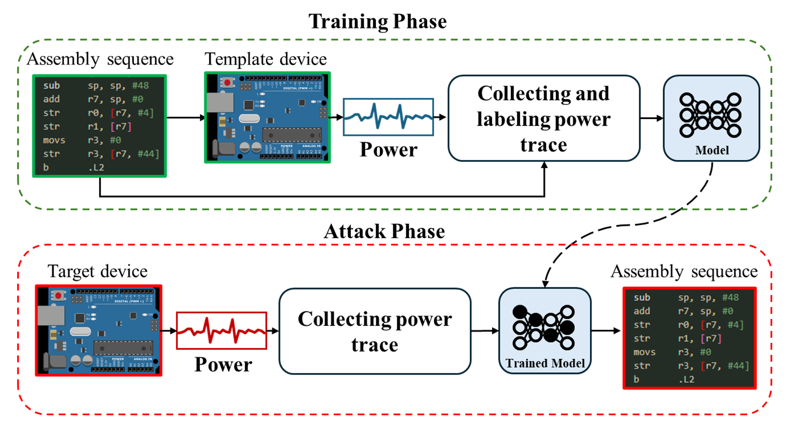
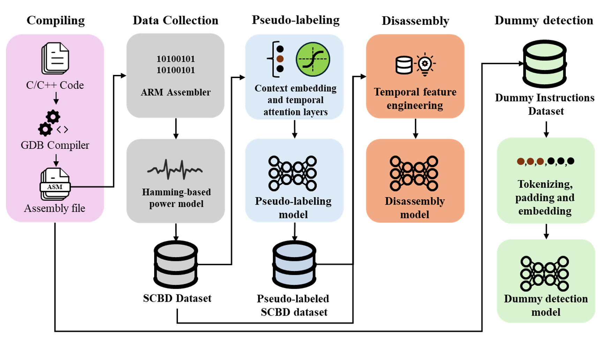

# reverse-engineering-ai-sca
Deep Learning-based Reverse Engineering via Side Channel Analysis

## Personal Information
- Name: Saleh Alabdulwahab
- Email: salehwahab@outlook.com
- LinkedIn: www.linkedin.com/in/Saleh-Alabdulwahab
- Portfolio: https://www.researchgate.net/profile/Saleh-Alabdulwahab
- CV: [CV PDF file](/SalehAlabdulwahab_CV.pdf)

## Overview
**"Pseudo-labeling for Deep Learning-based Side-channel Disassembly Using Contextual Layer and Feature Engineering"**

The project proposes a multi-phase framework for advanced side-channel based disassembly and dummy instruction detection using deep learning, feature engineering, and contextual sequence modeling.

---

## Objectives

- Develop a **pseudo-labeling** model to estimate power traces from assembly code.
- Create a **disassembly** model using engineered features and contextual models.
- Implement a **dummy instruction detection** model using sequence labeling.

---

## System Summary

1. **Dataset Creation**
   - Real cryptographic implementations (AES, RSA, DES, etc.)
   - Power traces generated via Signed Hamming Distance model
   - Total: 1.76 million samples, 24 instruction classes

2. **Leakage Modeling**
   - Side channel leakage modeling using a sequential model.
   - Leveraging contextual and embedding layers for accurate power leakage prediction.

4. **Pseudo-labeling**
   - GRU-based model with context embeddings and temporal attention
   - Outputs estimated power traces for unlabeled instruction sequences

5. **Feature Engineering**
   - Moving average, autocorrelation, and MLTI (Moving Log-transformed Temporal Interaction)

6. **Dummy Detection**
   - LSTM-based sequence labeling with token embedding
   - Detects obfuscation techniques like inserted dummy instructions
   
7. **LLM for Assembly to C**
   - After recovering the Assembly language, an LLM is used for converting it to human-readable C code

8. **Side Channel Forensics**
   - Using electromagnetic emission for wirelessly identifying a device's activities

---

## Key Results

- Power Estimation (R² = 0.9963)
- Disassembly Accuracy: High with MLTI + window size = 15
- Dummy Detection Accuracy: 97.9% with LSTM

---

## Figures

---

## Experiments

- Architecture comparisons: GRU, Transformer, LSTM + ANN
- Window size sensitivity analysis
- The effect of contextual layers in leakage modeling
- Cross-dataset validation
- Dummy instruction detection with sequence tokenization

---

## Published works from this project
For more details, please check my following publications.

1. Advanced Side-Channel Evaluation Using Contextual Deep Learning-Based Leakage Modeling, ACM
Transactions on Software Engineering and Methodology, 2025. Q1, IF: 6.6
https://dl.acm.org/doi/10.1145/3734219
2. Pseudo-Labeling for DL-Based Side-Channel Disassembly Using Contextual Layer and Feature Engineering,
Doctoral Dissertation, Dongguk University, 2025.
http://www.dcollection.net/handler/dgu/000000089549
3. Enhancing DL-Based Side-Channel Analysis Using Feature Engineering in a Fully Simulated IoT System, Expert
Systems with Applications, 2025. Q1, IF: 7.5
https://doi.org/10.1016/j.eswa.2024.126079
